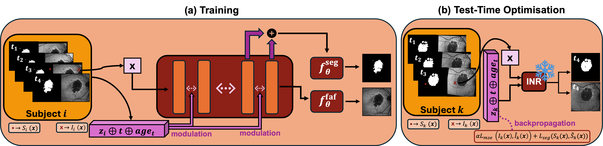

# GAP-INR — Geographic-Atrophy Progression with Implicit Neural Representations

GAP-INR forecasts the progression of geographic atrophy (GA) in age-related macular degeneration from
longitudinal fundus autofluorescence (FAF) imaging, using a conditional implicit neural representation
(INR). This repository covers data preparation, training, validation, testing, test-time adaptation,
and the figures.

## Contents
- [Attribution, license, citation](#attribution-license-citation)
- [How it works](#how-it-works)
- [Model architecture options](#model-architecture-options)
- [Repository layout](#repository-layout)
- [Installation](#installation)
- [Data preparation](#data-preparation)
- [The workflow: train, validate, test, adapt](#the-workflow-train-validate-test-adapt)
- [Outputs, logging, and checkpoints](#outputs-logging-and-checkpoints)
- [Reproducing the paper](#reproducing-the-paper)
- [Configuration reference](#configuration-reference)

---

## Attribution, license, citation

This work builds on a prior open-source INR framework ([`CINeMA, Dannecker et al., 2026`](github.com/m-dannecker/CINeMA/tree/main)); see
[`ATTRIBUTION.md`](ATTRIBUTION.md) for the credit. Released under [`LICENSE`](LICENSE) (Apache-2.0),
**except** `baselines/imageflownet/`, which is a derivative of [`ImageFlowNet, Liu et al., 2025`](https://github.com/KrishnaswamyLab/ImageFlowNet/tree/main), and carries the Yale
Non-Commercial licence shipped with it
([`baselines/imageflownet/ATTRIBUTION.md`](baselines/imageflownet/ATTRIBUTION.md)); that code is for
non-commercial research or evaluation only.

## How it works

<p align="center">
  
</p>

Each patient-eye is represented as a continuous field. One SIREN decoder is shared across the whole
dataset and modulated two ways:

- per eye, by a latent code (one latent per eye, shared across that eye's visits);
- per visit, by a temporal conditioning variable (weeks from baseline, and Age of the patient at that visit), applied as FiLM modulation.

From one query coordinate the decoder predicts the FAF intensity (reconstruction head) and the GA
segmentation (segmentation head). The model is 2-D and resolution-agnostic.

At test time the decoder is frozen and only a new eye's latent code is optimized (test-time
adaptation, TTA) on its available visits. Advancing the temporal condition then produces a future
visit, so the model can predict a GA mask for a visit whose image was never acquired. This is the
forecasting task the paper evaluates.

---

## Model architecture options

The architectural choices live in the `inr_decoder` section of `configs/config_model.yaml`. The values
shipped there are the paper's, and each knob below can be changed on its own, from the file or from
the command line (`--inr_decoder__hidden_size 512`).

### Output heads: shared or separate
- Separate heads (default, `shared_output_layer: false`). Two output layers: the reconstruction head
  reads the last SIREN layer and predicts FAF intensity; the segmentation head reads the penultimate
  layer and predicts the GA logits. Reading the segmentation logits one layer earlier uses slightly
  lower-frequency features, which segment better, and decouples the two tasks. The shipped config
  sets `seg_head_use_last_features: true`, so the paper's segmentation head sees the penultimate
  *and* last-layer features; set it to `false` for the penultimate layer alone.
- Shared output head (`shared_output_layer: true`). A single output layer maps to `[recon | seg]`
  together, as in the upstream framework. It is more parameter-efficient but couples the two
  tasks; when it is on, the `seg_head_*` and `seg_branch` options are ignored. 

### Segmentation-head capacity
- `seg_head_num_layers: 0` gives a single linear segmentation head (default); a value above 0 gives a
  ReLU MLP of width `seg_head_hidden_size`.
- `seg_head_use_last_features: true` also feeds the last-layer features (not only the penultimate
  layer) to the segmentation head.
- Dedicated segmentation branch (`seg_branch.activate: true`): a short SIREN sub-network taps a
  mid-trunk layer (`branch_layer`, default penultimate), is FiLM-modulated by the latent, and decodes
  labels through its own layers. It gives the segmentation more capacity than the head while still
  sharing the trunk, and replaces the penultimate segmentation head when active.

### Temporal conditioning: FiLM or input coordinate
- FiLM conditioning (default). The temporal variable modulates the SIREN via FiLM. Its encoding is set
  by `cond_encoding`: `raw` (scalar), `mlp` (learned embedding), or `fourier` (`cond_num_frequencies`
  bands).
- Time as input (`time_as_input: true`). The temporal variable enters as an extra INR input
  coordinate, optionally Fourier-encoded via `time_num_frequencies`. With a bare scalar
  (`time_num_frequencies: 0`) the decoder can ignore the time axis and emit the same image for every
  visit, so raise the frequency count when using this mode.
- `modulated_layers` sets which SIREN layers receive FiLM modulation (default: all).

### Latent representation
- `latent_dim: [C, H, W]` is a per-eye latent grid (channels by spatial dimension); more spatial resolution
  carries more per-eye detail. A grid that is too coarse cannot hand the shared decoder enough
  per-eye detail and the reconstruction blurs.
- Per-eye vs per-visit latents. By default one latent is shared across an eye's visits and time enters
  through conditioning. `independent_visits: true` (in `config_data.yaml`) gives one latent per visit
  instead (each visit is treated as an independent patient).
- `cnn_kernel_size` adds a CNN modulator that spatially mixes the latent grid (`0` is the identity, so it means no CNN).

### SIREN frequency (ω)
`omega_0` (first layer) with `omega_start`/`omega_end` and `schedule_type` (`constant`, `linear`, or
`exponential`) set the SIREN activation frequency per layer, which trades detail against smoothness.
Low frequencies bias the decoder toward coarse shape with no vessels or texture. `grid_search_omega.py`
sweeps this hyperparameter.

### Training
The decoder weights and the per-eye latents are optimized together during training
(auto-decoder). At test time the decoder is frozen and only the latent is fit.

### Inference post-processing
`renormalize_output` optionally stretches the reconstructed intensity per image; `seg_threshold` optionally sets the
confidence cutoff on P(GA) rather than the hard-coded 0.5; `seg_postprocess` (`keep_largest`, `min_area_px`) optionally cleans up connected
components in the GA mask.

---

## Repository layout

| Path | Role                                                                                                                      |
|---|---------------------------------------------------------------------------------------------------------------------------|
| `run.py` | Train entry point (assembles config, guards the split, launches the builder).                                             |
| `build_model.py` | Core engine (`ModelBuilder`): train / validate / test / test-time-adaptation loops, checkpointing, figures.               |
| `evaluate.py` | Standalone evaluation (val + test leave-one-out, TTA, clinical forecast) writing summary CSVs.                            |
| `summarize_eval.py` | Interpolation-vs-extrapolation held-out summary table.                                                                    |
| `temporal_sensitivity.py` | Static-collapse diagnostic (does the time conditioning do anything?).                                                     |
| `inference.py` | Minimal checkpoint-to-prediction wrapper.                                                                                 |
| `run_pipeline.sh` | One-command orchestrator (train, eval, diagnose, trajectory figure).                                                      |
| `plot_trajectories.py`, `plot_lesion_size_trajectories.py`, `seg_growth.py`, `analyze_faf_seg.py`, `visualize_grader_variability.py` | Figures and analysis.                                                                                                     |
| `grid_search_omega.py`, `run_grid_entry.py` | SIREN-frequency (ω₀) hyperparameter search.                                                                               |
| `verify_run_config.py` | Recover the config that a checkpoint was trained with.                                                                    |
| `configs/` | Model config (`config_model.yaml`), dataset config (`config_data.yaml`), split guard, lakeFS template.                    |
| `models/` | SIREN trunk, INR decoder, condition/time encoders, ω scheduler.                                                           |
| `data_loading/` | Dataset, coordinate sampling, preprocessing, optional remote (lakeFS) loader.                                             |
| `preprocessing/` | Scripts that build the clinical CSV and the train/val/test split.                                                         |
| `baselines/imageflownet/` | The paper's comparison methods (ImageFlowNet family), on the same split and scoring grid. Separately licensed, see below. |
| `docs/` | Documentation (see below).                                                                                                |
| `utils.py` | Shared library (loss, grids, image IO, logging, figure helpers).                                                          |

Documentation:
[`docs/DATA.md`](docs/DATA.md) (data preparation) ·
[`docs/REPRODUCIBILITY.md`](docs/REPRODUCIBILITY.md) (steps to reproduce the paper) ·
[`docs/PIPELINE.md`](docs/PIPELINE.md) (train, eval, diagnose, and what to monitor) ·
[`docs/BASELINES.md`](docs/BASELINES.md) (ImageFlowNet comparison).

---

## Installation

Python 3.10 and a CUDA-capable GPU are recommended.

```bash
conda env create -f environment.yml     # creates the 'gap-inr' env
conda activate gap-inr
# or:  pip install -r requirements.txt
```

The pipeline is 2-D only.

---

## Data preparation

See [`docs/DATA.md`](docs/DATA.md) for the full reference. In short:

**1. Metadata CSV.** One row per patient-eye visit (`configs/config_data.yaml → tsv_file`, default
`./data/clinical_metadata.csv`). Key columns (adjust depending on your data): `Eye_ID` (identity, maps to one latent), `split`
(train/val/test), `Patient_ID`, `Eye` (OD/OS), `Visit_ID`, `faf_path`, `ga_mask_path`, a time source
(`visit_date` or `diff` or `Visit_Number`), and optionally `AgeatVisit` and `ScaleXSlo`/`ScaleYSlo`
(mm/pixel, for area in mm²).

**2. Conditioning variables.** You do not pre-compute the time axis. Provide dates (`visit_date`),
elapsed days (`diff`), or `Visit_Number` plus a `visit_week_map`, and the loader derives
`weeks_from_baseline`. Any extra numeric covariate becomes a FiLM condition once you list it under
`conditions` and `constraints` in `config_data.yaml`. See [`docs/DATA.md §2–3`](docs/DATA.md).

**3. Folder structure.** GA masks follow a fixed layout; the FAF path comes from the CSV. lakeFS is
optional and off by default (local disk).

Local (default): masks resolve under `cache_path/branch/data/…`. With the defaults that is:

```
<repo>/
├── cache/faf_ga/main/data/<Patient_ID>/<Eye>/<Vxx>/Spectralis_faf/
│        ├── <Patient_ID>_<Eye>_<Vxx>_mask01.png     # (+ mask02/03 for majority/soft grader modes)
│        └── <Patient_ID>_<Eye>_<Vxx>_FAF.png        # FAF (point faf_path here, or anywhere)
└── data/clinical_metadata.csv
```

Use `mask_grader_mode: single` if you have one mask per visit (name it `…_mask01.png`); the paper uses
`majority` (majority vote among the three graders). Change `cache_path` to place everything under a different root.

lakeFS (optional): copy `configs/lakefs_cfg.example.yaml` to `configs/lakefs_cfg.yaml`, fill in the
endpoint and keys, and set `repo`/`branch`/`cache_path` in the `lakefs:` block. lakeFS object keys
mirror `data/<Patient_ID>/<Eye>/<Vxx>/Spectralis_faf/…`, and files download to `cache_path/branch/data/…`
on first use. Without the credentials file the loader reads from local disk.

**4. Split.** `preprocessing/add_split_column.py` writes a patient-wise `split` column. The canonical
partition is frozen in `configs/expected_split.yaml`, and every run aborts if the resolved split
differs (a leakage guard). [`docs/DATA.md §5–7`](docs/DATA.md) gives the exact folder trees and the
full column reference.

---

## The workflow: train, validate, test, adapt

### 1. Training (`run.py`)

Trains the shared SIREN decoder and the per-eye latents on the train split, minimizing FAF
reconstruction (MSE) plus GA segmentation (binary cross-entropy + Dice).

```bash
python run.py                                  # uses configs/config_model.yaml
python run.py --config_model path/to/your_config.yaml    # a different config
python run.py --inr_decoder__latent_dim "[256, 32, 32]"   # override a single knob
```

`validate_splits()` runs first and aborts on any train/val/test overlap or split mismatch. Checkpoints
are written every `validate_every` epochs, and the best one is selected on held-out validation DICE.

### 2. Validation, which is the test-time procedure

Validation runs the following procedure: the trained decoder is frozen, a fresh latent
is optimized on each val eye's optimization visits for `epochs.val` steps, and the model is evaluated
on the held-out visit. The held-out visit is never part of that fit, neither its image nor its mask.

The latent is fit with the same reconstruction + segmentation loss used in training
(`optimizer.seg_loss_val: true`, the shipped default). Setting
`seg_loss_val: false` fits the latent on the reconstruction loss alone and leaves segmentation as a
pure held-out signal; that is the stricter ablation, not the default.
This is what selects the best checkpoint. It runs during training, and can also run standalone:

```bash
python evaluate.py --checkpoint runs/faf_ga/<run>/checkpoint_best.pth \
    --holdout_strategy leave_one_out --test off        # val only (model selection)
```

### 3. Testing

Run the selected model once on the test split (comparing configs on the test set would leak):

```bash
python evaluate.py --checkpoint runs/faf_ga/<run>/checkpoint_best.pth \
    --holdout_strategy leave_one_out --test on
```

This runs full leave-one-out over every visit position and calls `summarize_eval.py`, writing
`evaluation_*/leave_one_out_summary.csv` with held-out DICE, PSNR, SSIM, LPIPS, Hausdorff distance, and
lesion-area MAE, grouped into interpolation and extrapolation.

### 4. Test-time adaptation and forecasting scenarios

- Scenario 1 (single pair): predicts a target visit from one earlier visit.
- Scenario 2 (full history): adapt the eye's latent on all past visits, then forecast. `--support_k K`
  fits on the first `K` visits and predicts the rest (`--support_k 1` forecasts everything from the
  baseline visit):

```bash
python evaluate.py --checkpoint runs/faf_ga/<run>/checkpoint_best.pth --support_k 1 --skip_val
```

`--epochs_val N` sets the TTA budget (number of latent-fit steps).

### 5. Diagnose and visualize

```bash
python temporal_sensitivity.py --checkpoint runs/faf_ga/<run>/checkpoint_best.pth --split test   # RESPONSIVE / COLLAPSED
python plot_trajectories.py --csv runs/faf_ga/<run>/evaluation_*/lesion_analysis/lesion_areas_test_epoch_*.csv --split test
```

`./run_pipeline.sh` runs the whole sequence and picks a free GPU. [`docs/PIPELINE.md`](docs/PIPELINE.md)
covers what to watch during training.

---

## Outputs, logging, and checkpoints

Each run creates `runs/<config>_<timestamp>_<jobid>/` with:

- `config_model.yaml` and `config_data.yaml`, the exact configs used.
- `checkpoint_best.pth` (best held-out DICE), `checkpoint_best_loss.pth`, and periodic
  `checkpoint_epoch_*.pth`. A checkpoint stores the decoder weights, the latents, the config, and the
  dataframe.
- `tb_logs/` for TensorBoard (loss terms, held-out DICE/PSNR/SSIM, time-sensitivity, reconstruction
  figures); view with `tensorboard --logdir runs/faf_ga/<run>/tb_logs`.
- per-split metric JSONs and CSVs, reconstruction and publication figures, and `lesion_analysis/`.
- `evaluate.py` adds `evaluation_*/` with `leave_one_out_summary.csv`.

For Weights & Biases logging, set `logging: True` and a `wandb_entity` in `config_model.yaml`.

---

## Reproducing the paper

[`configs/config_model.yaml`](configs/config_model.yaml) ships the paper's configuration: SIREN hidden
384 over 8 FiLM-modulated layers, latent `[256, 32, 32]`, ω = 30, `sr_weight` 10, `lr_inr` 1e-4,
`lr_latent` 5e-3, on a 620-crop resized to a 512 grid. Running `python run.py` with it unchanged reproduces the main result.
[`docs/REPRODUCIBILITY.md`](docs/REPRODUCIBILITY.md) has the step-by-step instructions and the
baseline protocol. The comparison methods are the ImageFlowNet model, as well as the comparing methods used in their paper (I2SBUNet and T-UNet)
([`docs/BASELINES.md`](docs/BASELINES.md)).

---

## Configuration reference

Two YAML files are merged at startup (`run.py`):

- `configs/config_model.yaml`: model, optimizer, and training (decoder architecture, `latent_dim`,
  SIREN `omega_*`, loss weights, `epochs`, TTA budget, checkpoint selection). It carries a
  `config_data:` key naming the dataset section to use.
- `configs/config_data.yaml`: dataset section.

---
